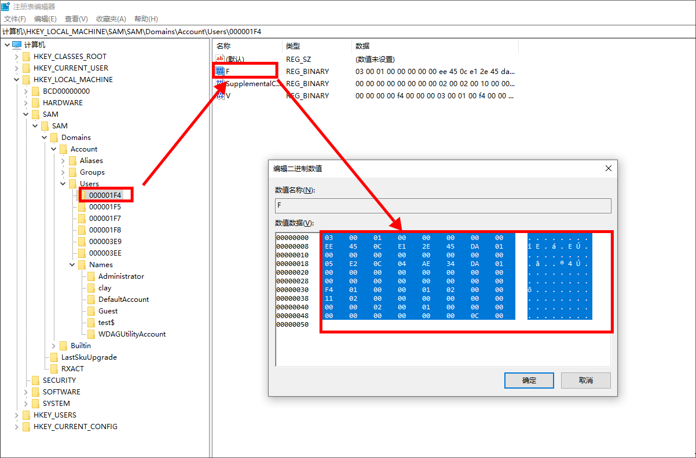

## 0x00 环境搭建

- win10 
- 已经获取最高权限


## 0x01 创建影子账户


### 一.  关闭杀软

不然……我谢谢你啊 360 火绒


### 一. 创建用户

在windows下，如果在用户名后面添加一个$符号的话，那么通过**net user**的方式是看不到的。

````
net user test$ 12138 /add
net localgroup administrators test$ /add 
````

但是在控制面板的用户管理那边还是能看到的


### 三. 注册表导出

`regedit`打开注册表，找到如下路径：

```powershell
计算机\HKEY_LOCAL_MACHINE\SAM\SAM\Domains\Account\Users
```

点击用户名，可以看到有个类型，这个类型的值和上面0000那一串字符相对应


1. 找到Administrator对应的0000开头的项（我这里是01F4），双击F复制其中的内容



2. 复制给我们创建账户的F值


3. 导出我们创建账户的注册表，两个都要导出


### 四. 删除用户


删除后我们刷新一下注册表和控制面板，能看到都没了


### 五. 导入注册表

双击确认导入


或者命令行导入

```powershell
regedit /s C:\Users\clay\Desktop\000001F4.reg  
regedit /s C:\Users\clay\Desktop\test$.reg 
```


操作好后可以看到注册表有信息了：


此时控制面板的账户管理也看不到任何信息了


## 0x02 拓展

创建好影子账户后要怎么使用呢?