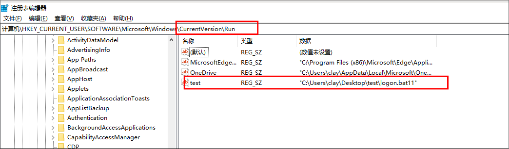
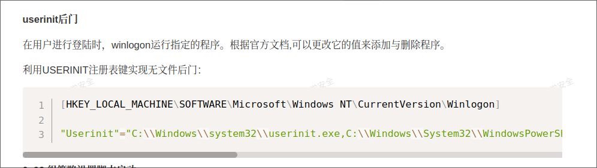

## 0x00 环境搭建

- win10 


## 0x01 利用

### 一. 开机自启动

> 参考：https://xbxaq.com/doc/71/


- **作用**：开机自启动

```bat
# 弹窗计算器
@echo off
start calc.exe
```


- 相关注册表项

````bash
# Run键 下面两项都有效
HKEY_CURRENT_USER\Software\Microsoft\Windows\CurrentVersion\Run
HKEY_LOCAL_MACHINE\SOFTWARE\Microsoft\Windows\CurrentVersion\Run

# Winlogon\Userinit键
#测试无效 HKEY_CURRENT_USER\SOFTWARE\Microsoft\Windows NT\CurrentVersion\Winlogon
# 测试无效 HKEY_LOCAL_MACHINE\SOFTWARE\Microsoft\Windows NT\CurrentVersion\Winlogon

类似的还有很多,关键词：注册表启动键值。
````




### 二. Userinit 脚本（win10 测试无效）

- 参考https://xbxaq.com/doc/71/





### 三. logon script后门（win10 测试无效）

