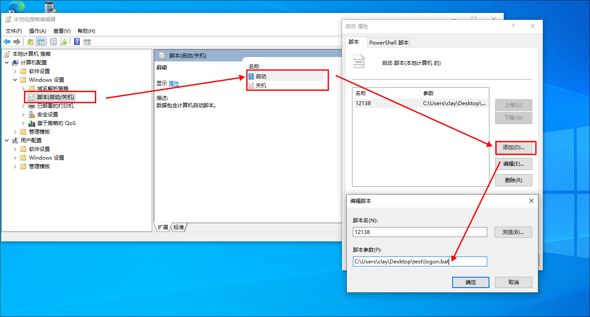
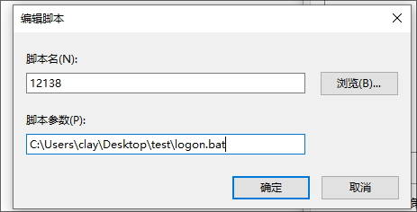

## 0x00 环境搭建

- win10


## 0x01 利用

`win + R `输入

```powershell
gpedit
```

在windows设置 / 脚本(启动/关机) ，添加启动时或者关机时的执行脚本



脚本名字可以随便，脚本参数一定是要绝对路径




<span style="color:red">注意:</span>

​	1. 用户配置 / windowse设置 / 脚本 登陆或者注销时候的脚本**测试无效！**