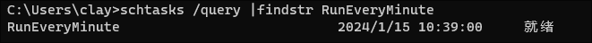
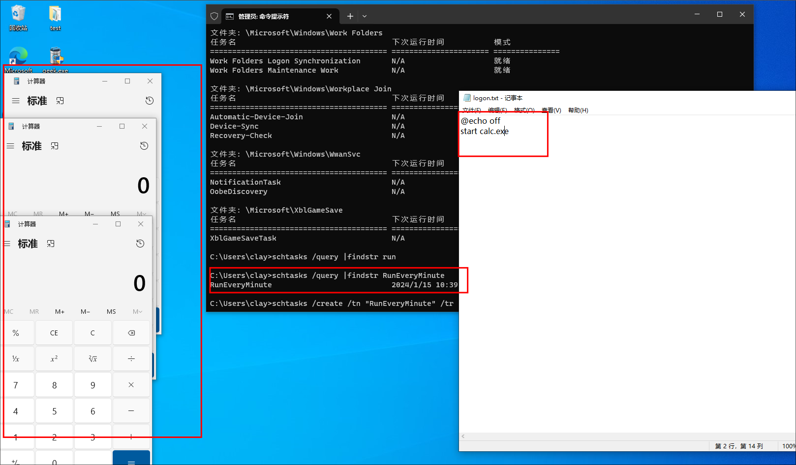

## 0x00 环境搭建

- win10


## 0x01 利用

- 参考  https://juejin.cn/post/6868893470019780616


主要是使用`schtasks`命令


**实验：**

​	每分钟运行一次 `C:\Users\clay\Desktop\test\logon.bat` 脚本

```powershell
@echo off
start calc.exe
```

1. 制作计划任务：

````
schtasks /create /tn "RunEveryMinute" /tr "C:\Users\clay\Desktop\test\logon.bat" /sc MINUTE /mo 1
````


2. 查看`schtasks /query |findstr "任务名"` 



3. 运行结果

